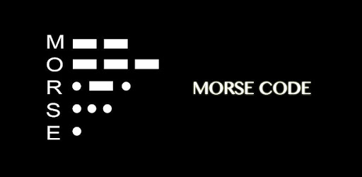

# Morse Code: Standard Edition
In this assignment you will create a python script that can decode messages provided in Morse code format. This assignment is from a Codewars kata, see References below.

Morse code and telegraphs were widely used in the US in the 1850s and 1860s. It was the very first telecommunication device, and revolutionized the way people messaged each other. To this day, it still has its use in some applications, but has mostly been replaced with digital data channels.

The Morse code encodes every character as a sequence of "dots" and "dashes". For example, the letter 'A' is coded as `.-`, the letter 'Q' is coded as `--.-`, and the digit 1 is coded as `.----`. The Morse code is case-insensitive, traditionally capital letters are used. When the message is written in Morse code, a single space is used to separate the character codes, and 3 spaces are used to separate words. For example, the message "HEY JUDE" in Morse code is <code>.... . -.--&nbsp;&nbsp;&nbsp;.--- ..- -.. .</code>

*NOTE*: Extra spaces before or after the code have no meaning and should be ignored.

# Learning Objectives
- Strings, Loops, Dictionaries
- List Comprehensions

# Instructions

## Decode the Morse Code
Complete the `decode_morse` function within the `morse.py` module provided. The function accepts a string parameter, which consists of '.' and '-' and ' ' characters arranged to form a Morse code message. The function should use the included MORSE_2_ASCII mapping between Morse letters and alphabetic characters to return an ASCII string which represents the decoded input message.

```
decode_morse(".... . -.--   .--- ..- -.. .") -> "HEY JUDE"
```

Use the built-in tests from this assignment to test your function. Your `decode_morse` function should pass all of the included unit tests.

### Hints
- The Morse code dictionary is already imported for you.  There is a MORSE_2_ASCII and also an ASCII_2_MORSE table.
- All the tests contain valid Morse code, so don't worry about error checking &mdash; concentrate on decoding the message.

## Testing with `unittest`
This assignment has separate unit tests to help you during development. The unit tests are located in the `tests` folder; you should not modify these. Make sure all unit tests are passing before you submit your solution. You can invoke the unit tests from the command line at the root of your project folder:
```console
$ python -m unittest discover tests
```
You can also run these same tests using the `Test Explorer` extension built in to the VSCode editor, by enabling automatic test discovery. This is a really useful tool and we highly recommend to learn it.

https://code.visualstudio.com/docs/python/testing#_test-discovery

- Test framework is `unittest`
- Test folder pattern is `tests`
- Test name pattern is `test*`

## Submitting your work
To submit your solution for grading, you will need to create a github [Pull Request (PR)](https://docs.github.com/en/github/collaborating-with-issues-and-pull-requests/about-pull-requests). Refer to the `PR Workflow` article in your course content for details.

# References
- [How Morse Code Works and Still Lives On in the Digital Age](https://science.howstuffworks.com/innovation/inventions/morse-code.htm)
- [Codewars Decode the Morse Code](https://www.codewars.com/kata/decode-the-morse-code/python)
